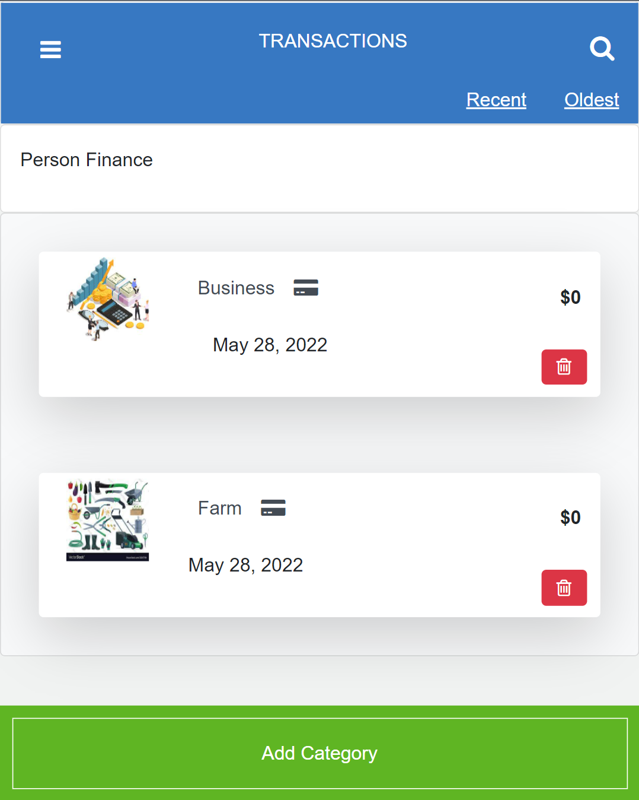

# Recipe app

>  A budget app is a mobile web application where you can manage your budget: you have a list of transactions associated with a category, so that you can see how much money you spent and on what.


> ### Video Link
> [Watch video](https://www.loom.com/share/837813a1a8a04444938bc6f23db30965)

> ## Live Link
> [Visit website](https://afternoon-ocean-53619.herokuapp.com/)

### Preview




# How to build the Budget app
The end result should follow the data model below (this is an Entity Relationship Diagram that you are already familiar with):

> 

## Built With

- Ruby on Rails
- Bootstrap
- JQuery
- Ruby
- Bubocop
- Gems
  - Rspec
  - Capybara
  - Selenium-webdriver
  - Bcrypt
  - Letter-opener
  - Faker
  - cancancan
  - Devise
  - ffi


## Getting Started

**To get a local copy up and running follow these simple example steps.**

### Prerequisites
- Ruby should be installed on your machine
- Install Ruby on Rails and PostgresQL

### Setup
```
git clone https://github.com/butlermuwo/Budget-app.git
cd Budget-app
```
### Install
```
bundle install
```

### Play with the code
```
rails c
```

### Populate the db with dummy data
```
rake db:migrate
rake db:seed
```

### Run linters
```
rubocop -A
```

### Start the application
```
rails s
```

### Tests
```
rspec spec (run all tests)
rspec spec/name_of_folder/name_of_file.rb (run specific tests)
```
### Author

👤 **Butler Shimaluwani**

- GitHub: [@Butlermuwo](https://github.com/butlermuwo)
- Twitter: [@Butlermuwo](https://twitter.com/ButlerMuwo)
- LinkedIn: [@Butlermuwo](https://www.linkedin.com/in/butlermuwo)

## 🤝 Contributing

Contributions, issues, and feature requests are welcome!

Feel free to check the [issues page](../../issues/).

## Show your support

Give a ⭐️ if you like this project!

## Acknowledgments
-  An acknowledgment to Gregorie Vella on Behance, the author of the original design.
- Many thanks to Microverse

## 📝 License

This project is [MIT](./MIT.md) licensed.